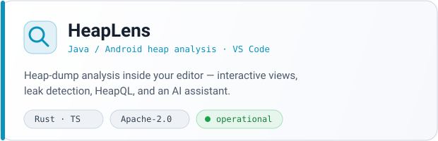
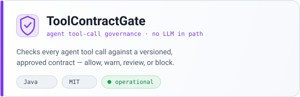
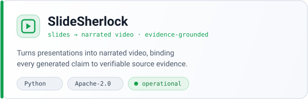
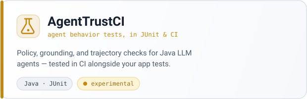
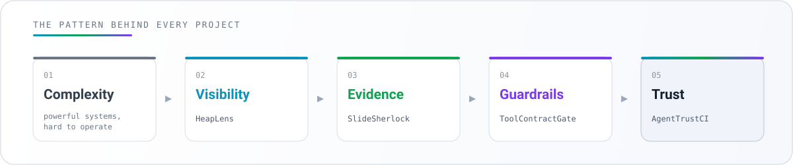
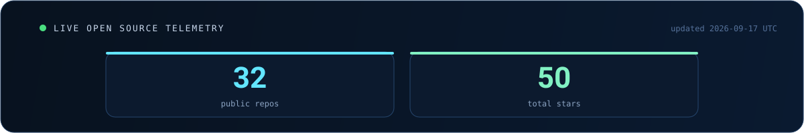
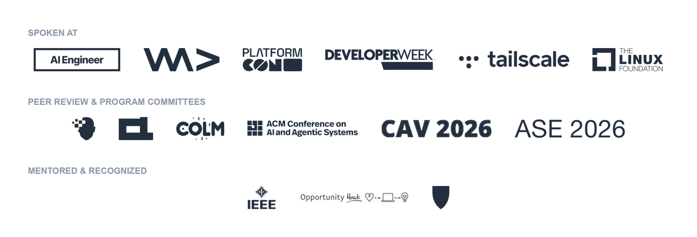

<p align="center">
  
</p>

<p align="center">
  <a href="https://www.guptasachinn.com"></a>
  <a href="https://www.linkedin.com/in/guptasachin1/"></a>
  <a href="https://medium.com/@sachinkg12"></a>
  <a href="https://orcid.org/0009-0009-7422-4967"></a>
  <a href="https://sessionize.com/sachin-gupta"></a>
</p>

<div align="center">

### Backend engineer building AI infrastructure at production scale

I build open source tools that make complex software and AI systems  
**observable, explainable and safer to operate.**

`15+ years in backend systems`　`open source`　`AI reliability`　`speaker`　`mentor`

</div>

<br />

```yaml
profile_runtime:
  name: Sachin Gupta
  location: San Jose, California
  mission: Make complex systems easier to understand and trust
  operating_mode: Human led, AI accelerated
  current_focus:
    - Developer tools for JVM and distributed systems
    - Guardrails, evaluation and evidence for AI agents
    - Practical engineering education
  side_quests:
    - Travel with family
    - Photograph places better than I remember to organize them
    - Find vegetarian food before the production incident starts
```

> [!NOTE]
> **My engineering bias:** intelligence is useful, but evidence is deployable.

## The trust stack I am building

<table>
<tr>
<td width="50%">
<a href="https://github.com/sachinkg12/heaplens">

</a>
</td>
<td width="50%">
<a href="https://github.com/sachinkg12/toolcontractgate">

</a>
</td>
</tr>
<tr>
<td width="50%">
<a href="https://github.com/sachinkg12/SlideSherlock">

</a>
</td>
<td width="50%">
<a href="https://github.com/sachinkg12/agenttrustci">

</a>
</td>
</tr>
</table>

<p align="center">
  <a href="https://marketplace.visualstudio.com/items?itemName=guptasachinn.heaplens"></a>
  <a href="https://open-vsx.org/extension/guptasachinn/heaplens"></a>
  <a href="https://github.com/sachinkg12/heaplens/releases"></a>
</p>

## The idea behind the projects

<p align="center">
  
</p>

The projects look different, but they follow the same pattern:

* **HeapLens** makes runtime memory behavior visible.
* **SlideSherlock** connects generated narration to source evidence.
* **ToolContractGate** constrains what an agent is allowed to call.
* **AgentTrustCI** tests whether agent behavior matches policy and grounding expectations.

The goal is not to put AI everywhere. The goal is to make powerful systems **understandable enough to operate responsibly**.

## Live open source telemetry

<p align="center">
  
</p>

This panel is generated from the GitHub API by the workflow in this profile repository. It updates the public repository count and total stars across my open source projects.

<details>
<summary><b>Why automate the profile?</b></summary>
<br />

Because a 2026 profile should not be a résumé frozen in Markdown.

The automation is intentionally small and inspectable. It uses GitHub's public API, generates one local SVG and commits only when the numbers change. No analytics pixel, no private data and no mystery profile service.

</details>

## I build in public across four loops

<table>
<tr>
<td width="25%" valign="top">
<h3>01 / Build</h3>
<p>Developer tools, experiments, datasets and reference implementations that people can run.</p>
</td>
<td width="25%" valign="top">
<h3>02 / Explain</h3>
<p>Field guides, visualizers and talks that turn difficult engineering ideas into usable mental models.</p>
</td>
<td width="25%" valign="top">
<h3>03 / Review</h3>
<p>Research reviewing, artifact evaluation and honest technical feedback for other builders.</p>
</td>
<td width="25%" valign="top">
<h3>04 / Connect</h3>
<p>Mentoring, hackathon judging, community conversations and contributor support.</p>
</td>
</tr>
</table>

### Selected signals from the field

| Signal | What you will find |
|---|---|
| **Engineering writing + visualizers** | Practical field guides and interactive explainers on [guptasachinn.com](https://www.guptasachinn.com/) |
| **[RAG field guide](https://www.guptasachinn.com/tags/rag)** | A practical series covering retrieval, context, abstention, citations and vectorless RAG |
| **[Inference series](https://www.guptasachinn.com/writing/dspark)** | Visual explanations of speculative decoding and DSpark |
| **Open source lab** | Tools spanning JVM memory, AI agent safety, evidence grounded media and CI evaluation |

## Talks that became tools

I share practical engineering patterns from production — usually alongside open-source implementations you can inspect, run, and challenge.

<table>
<tr>
<td width="50%" valign="top">
<a href="https://www.youtube.com/watch?v=TJPInBjhE4Q">

</a>
<p><b>ReviewDebt: scoring every pull request</b><br/>
A measurable framework for the widening gap between agent-generated code and human-reviewed evidence.</p>
</td>
<td width="50%" valign="top">
<a href="https://www.youtube.com/watch?v=zU4EagB311U">

</a>
<p><b>Agents Need Feature Flags</b><br/>
Runtime control and safe rollout for autonomous AI agents in production.</p>
</td>
</tr>
</table>

## Organizations I've collaborated with

<p align="center">
  
</p>

<p align="center"><sub>Speaking · peer review &amp; program committees · mentoring — <a href="https://www.guptasachinn.com/">full activity log</a></sub></p>

## Beyond the terminal

<table>
<tr>
<td width="58%" valign="top">
<h3>Travel is my second distributed system</h3>
<p>There are unreliable networks, partial information, regional dependencies, strict latency budgets and at least one stakeholder asking, “Are we there yet?”</p>
<p>I travel with my family and photograph landscapes, cities and the moments between destinations. Photography has trained the same instinct I use in engineering: slow down, observe carefully and change the frame before changing the answer.</p>
<p><b>Current travel protocol</b></p>
<pre>
plan ambitiously
cache snacks locally
expect partial failure
preserve the evidence
take the photo
</pre>
</td>
<td width="42%" valign="top">
<pre>
CAMERA STATUS
─────────────
battery       34%
storage       somehow full
golden hour   18:42
trip backlog  unbounded
best photo    still not sorted
</pre>
<p><i>A good itinerary, like a good distributed system, assumes something will fail.</i></p>
</td>
</tr>
</table>

## Start here

<table>
<tr>
<td align="center" width="25%">
<a href="https://github.com/sachinkg12/heaplens/issues"><b>Use a tool</b></a><br />
<sub>Try it on a real problem</sub>
</td>
<td align="center" width="25%">
<a href="https://github.com/issues?q=is%3Aopen+is%3Aissue+user%3Asachinkg12"><b>Report a rough edge</b></a><br />
<sub>Honest feedback beats vanity metrics</sub>
</td>
<td align="center" width="25%">
<a href="https://github.com/issues?q=is%3Aopen+is%3Aissue+user%3Asachinkg12+label%3A%22good+first+issue%22"><b>Make a first contribution</b></a><br />
<sub>Small pull requests are welcome</sub>
</td>
<td align="center" width="25%">
<a href="https://www.guptasachinn.com/"><b>Learn with me</b></a><br />
<sub>Read, visualize and question</sub>
</td>
</tr>
</table>

## Current operating state

```diff
+ building tools that make AI behavior easier to verify
+ publishing engineering explanations with working visualizers
+ looking for users, contributors and uncomfortable edge cases
+ planning the next trip before sorting the previous trip's photographs
- pretending that an LLM response is evidence
```

<div align="center">

### Build carefully. Share openly. Keep exploring.

<sub>All views are my own and shared in a personal capacity.</sub>

</div>
